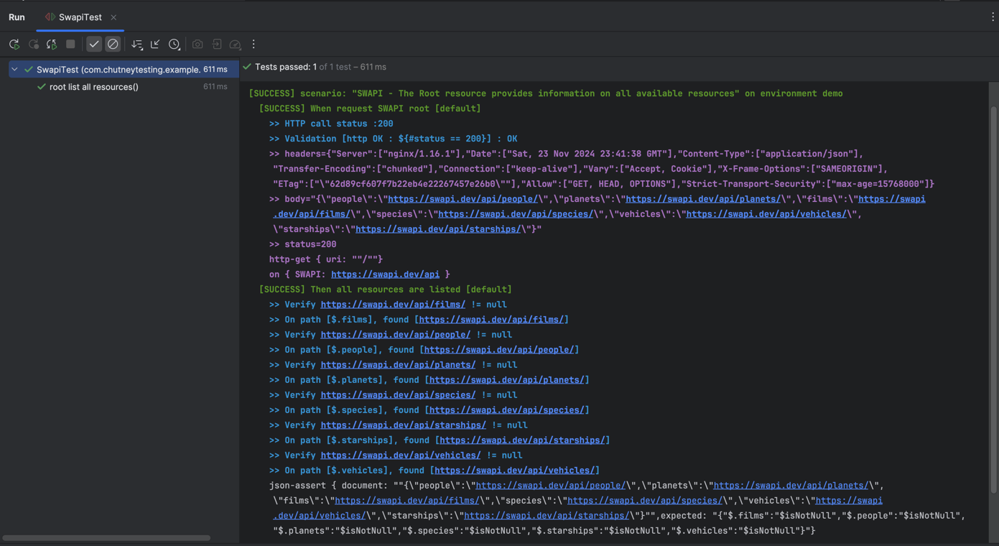

<!--
  ~ SPDX-FileCopyrightText: 2017-2024 Enedis
  ~
  ~ SPDX-License-Identifier: Apache-2.0
  ~
  -->

# Chutney
## Spice up your spec , Better `taste` your app !

[](https://github.com/Enedis-OSS/chutney/actions/workflows/build-all.yml)
[](https://www.codacy.com/gh/chutney-testing/chutney?utm_source=github.com&amp;utm_medium=referral&amp;utm_content=chutney-testing/chutney&amp;utm_campaign=Badge_Grade)
[](https://codecov.io/gh/chutney-testing/chutney/)
[](https://github.com/Enedis-OSS/chutney/actions/workflows/reuse.yml)
[](https://github.com/Enedis-OSS/chutney/releases)
[](https://maven-badges.herokuapp.com/maven-central/com.chutneytesting/server)
[](https://github.com/Enedis-OSS/chutney/pkgs/container/chutney%2Fchutney-server)

-------------

## Summary

* [Introduction](#introduction)
* [Demo](#demo)
* [Installation](#installation)
* [Scenario Example](#scenario_example)
* [Documentation](#documentation)
* [Contributing](#contrib)
* [Support](#support)
* [Contributors](#contributors)

-------------

## <a name="introduction"></a> Introduction
Chutney aims to **test deployed software** in order to validate functional requirements.

Chutney scenarios are **declarative** written with a **kotlin dsl**. They provide functional requirements and technical details (needed for automation) in a single view.

Chutney is also released as a standalone application including a test execution engine and a a web front end to consult test reports.  

Technical details are provided by generic [Actions](https://github.com/Enedis-OSS/chutney/blob/main/chutney/action-spi/src/main/java/com/chutneytesting/action/spi/Action.java) (such as HTTP, AMQP, MongoDB, Kafka, Selenium, etc.)  
Those Actions are extensions, and you can easily develop yours, even proprietary or non-generic one, and include them in your own release.

In addition, Chutney provide SpEL evaluation and extensible [Function](https://github.com/Enedis-OSS/chutney/blob/main/chutney/action-spi/src/main/java/com/chutneytesting/action/spi/SpelFunction.java) in order to ease the use of managing scenario data like JSON path or Date comparison.

[Find out more in the documentation !](https://www.chutney-testing.com/)

Still asking yourself ["Why another test tool ?"](https://www.chutney-testing.com/concepts/)

-------------
## <a name="demo"></a> Demo

Follow [this](https://github.com/Enedis-OSS/chutney/tree/main/example/.docker#demo-server-container-using-docker-compose) documentation to launch a [docker compose](https://github.com/Enedis-OSS/chutney/blob/main/example/.docker/dev-docker-compose-demo.yml) stack.  
The Chutney web interface should be visible at http://localhost (admin/Admin).

-------------

## <a name="installation"></a> Installation

#### Locally

In order to install Chutney on your machine, you can use Java or Docker. 
See [Start a server](https://www.chutney-testing.com/installation/local_dev/#start-a-server).

#### On premise

See [installation on premise](https://www.chutney-testing.com/installation/on_premise/), for details if you want to customize your own version of chutney server.

-------------

## <a name="scenario_example"></a> Scenario Example

You can find all the documentation of how to write a scenario [here](https://www.chutney-testing.com/getting_started/write/).

### Scenario

Here is an example of a scenario written in Kotlin ([source code](https://github.com/Enedis-OSS/chutney/blob/2effe53b2b73fc3b89b6f072b57a02c0e856e0a1/example/src/main/kotlin/com/chutneytesting/demo/spec/swapi.kt#L48))

```kotlin
  const val TARGET = "SWAPI"
  
  val root_list_all_resources =
  Scenario(
    id = 123000,
    title = "SWAPI - The Root resource provides information on all available resources",
    tags = listOf(TAG)
  ) {
    When("When request SWAPI root") {
      HttpGetAction(
        target = TARGET,
        uri = "/",
        validations = mapOf(
          httpStatusOK()
        )
      )
    }
    Then("Then all resources are listed") {
      JsonAssertAction(
        document = "body".spEL(),
        expected = mapOf(
          "$.films" to "\$isNotNull",
          "$.people" to "\$isNotNull",
          "$.planets" to "\$isNotNull",
          "$.species" to "\$isNotNull",
          "$.starships" to "\$isNotNull",
          "$.vehicles" to "\$isNotNull"
        )
      )
    }
  }
```

* In this example the scenario will list resources provided by [swapi](https://swapi.dev/api) api using http get action.
* Then it will some expected resources are found in the api response using json assertion action.
* All available Chutney Actions are documented [here](https://www.chutney-testing.com/documentation/actions/).

### Execution report
#### In Intellij
When executing the previous scenario from your intellij using a [junit test](https://github.com/Enedis-OSS/chutney/blob/main/example/src/test/kotlin/com/chutneytesting/example/http/SwapiTest.kt), the execution report will be printed in the console.


#### In chutney UI
After [synchronizing](https://github.com/Enedis-OSS/chutney/blob/main/example/src/main/kotlin/com/chutneytesting/demo/sync/demoServer.kt#L29) the previous scenario with a running chutney server, you can run it from the UI.


### More examples
You can find some other example with http,jms, kafka, rabbit or sql [here](https://github.com/Enedis-OSS/chutney/tree/main/example/src/main/kotlin/com/chutneytesting/example/scenario)

-------------

## <a name="documentation"></a> Documentation

Get the [official documentation](https://www.chutney-testing.com/) for more information about how Chutney works.

-------------

## <a name="contrib"></a> Contributing ?


See the [Getting started](GETTING_STARTED.md), which document how to install and setup the required environment for developing

You don't need to be a developer to contribute, nor do much, you can simply:
* Enhance documentation,
* Correct a spelling,
* [Report a bug](https://github.com/Enedis-OSS/chutney/issues/new/choose)
* [Ask a feature](https://github.com/Enedis-OSS/chutney/issues/new/choose)
* [Give us advices or ideas](https://github.com/Enedis-OSS/chutney/discussions/categories/ideas),
* etc.

To help you start, we invite you to read [Contributing](CONTRIBUTING.md), which gives you rules and code conventions to respect

To contribute to this documentation (README, CONTRIBUTING, etc.), we conform to the [CommonMark Spec](https://spec.commonmark.org/)

## <a name="support"></a> Support

We’re using [Discussions](https://github.com/Enedis-OSS/chutney/discussions) as a place to connect with members of our - slow pace growing - community. We hope that you:
  * Ask questions you’re wondering about,
  * Share ideas,
  * Engage with other community members,
  * Welcome others, be friendly and open-minded !

## <a name="contributors"></a> Contributors

Core contributors :
* [Mael Besson](https://github.com/bessonm)
* [Nicolas Brouand](https://github.com/nbrouand)
* [Alexandre Delaunay](https://github.com/DelaunayAlex)
* [Matthieu Gensollen](https://github.com/boddissattva)
* [Karim Goubbaa](https://github.com/KarimGl)
* [Loic Ledoyen](https://github.com/ledoyen)

We strive to provide a benevolent environment and support any [contribution](#contrib).
