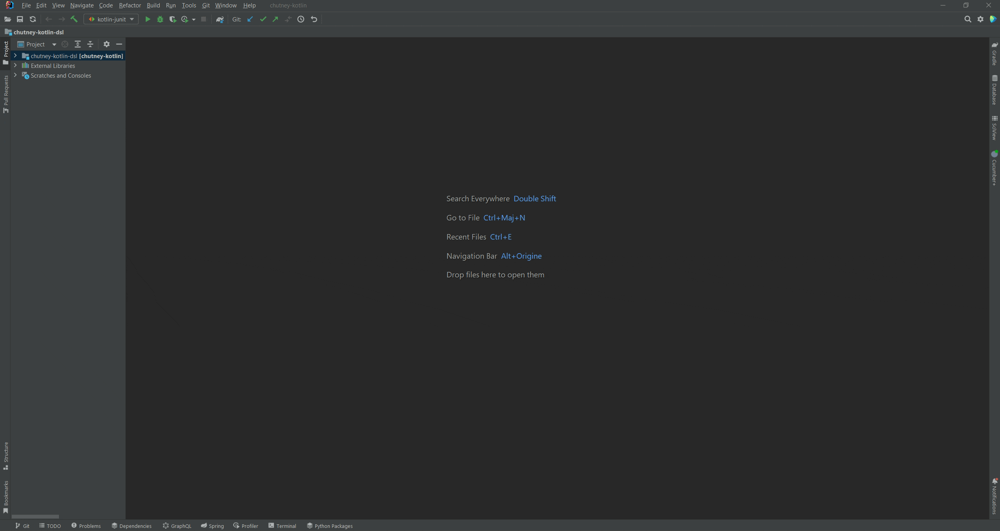
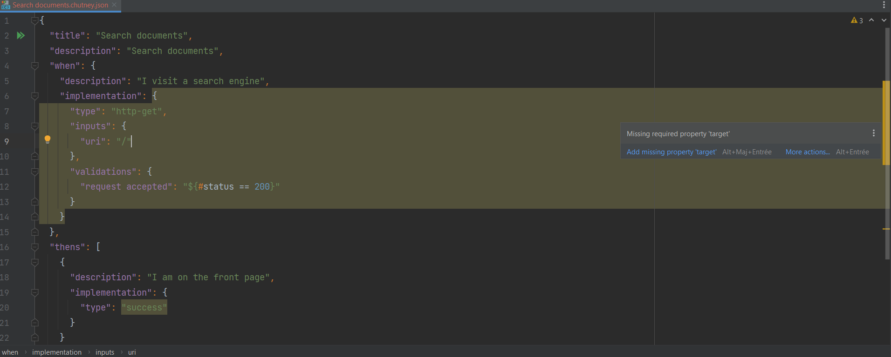
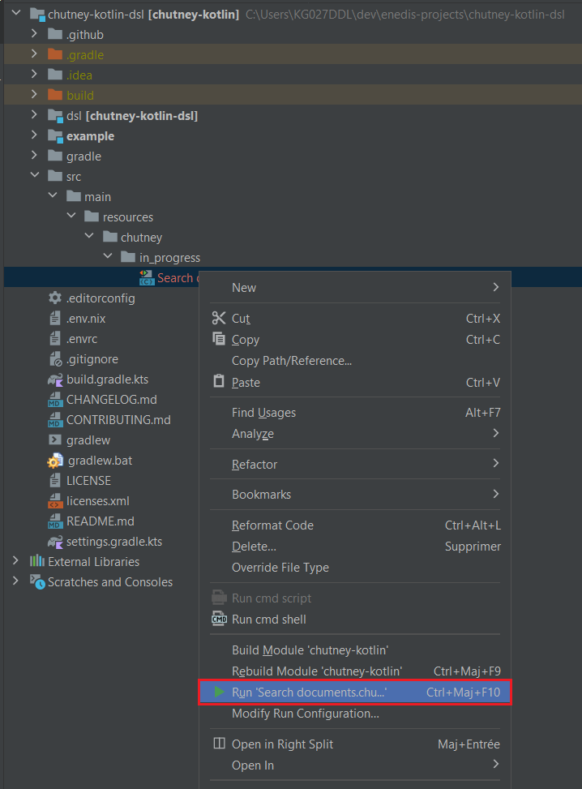
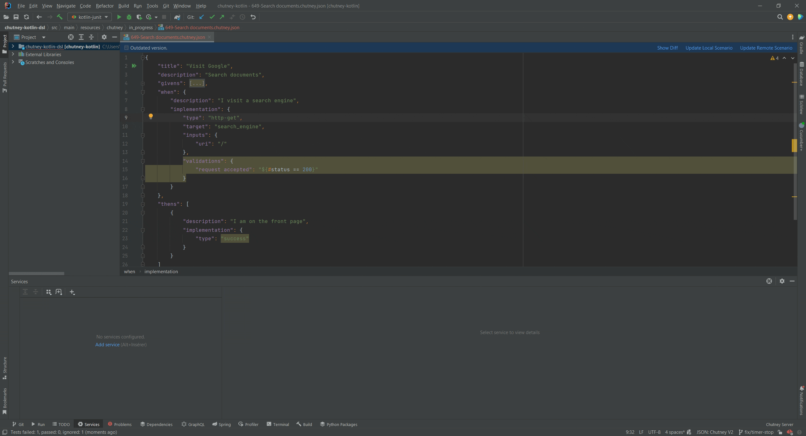
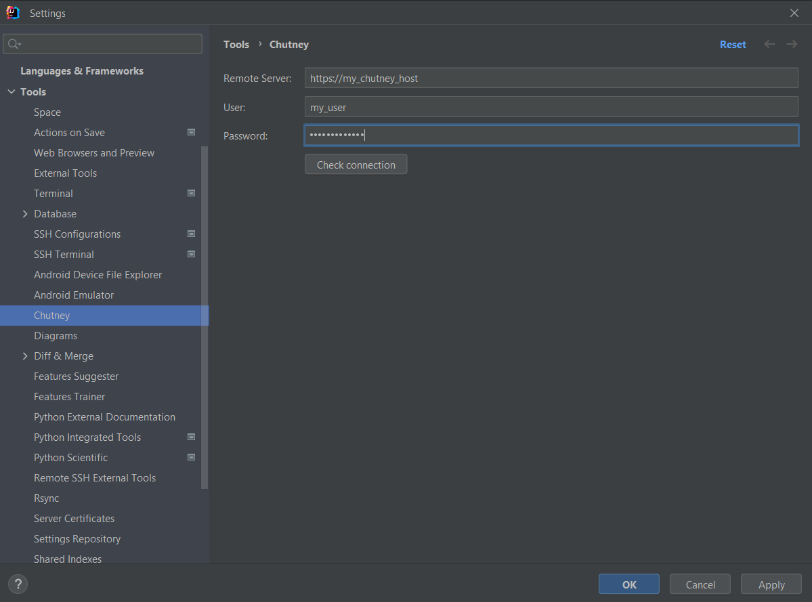
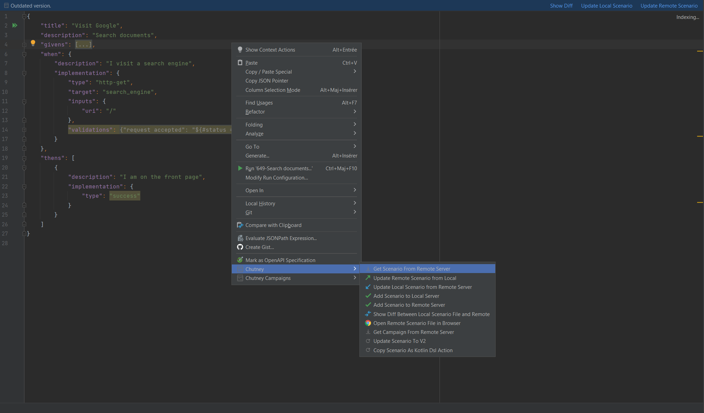
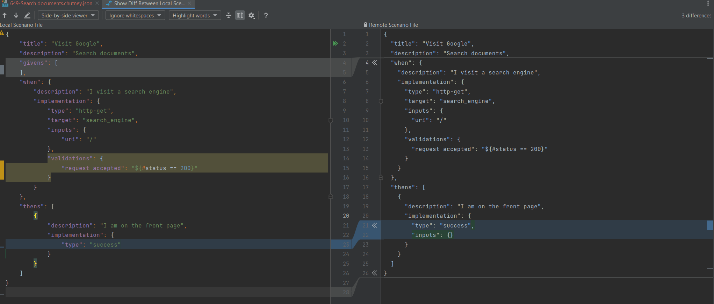
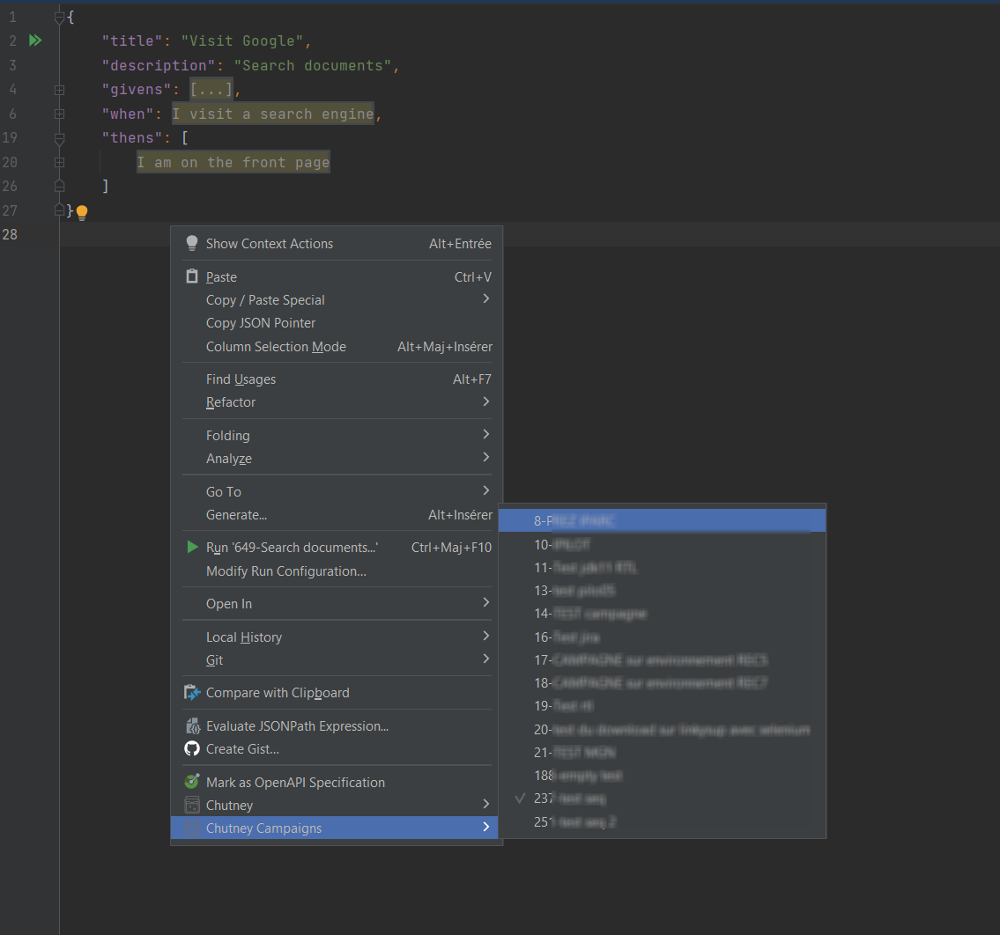
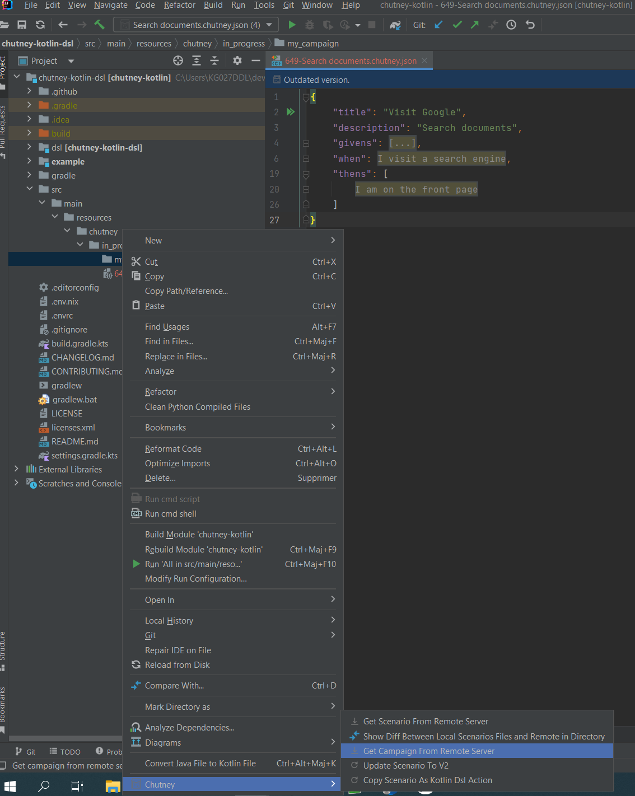

<!--
  ~ SPDX-FileCopyrightText: 2017-2024 Enedis
  ~
  ~ SPDX-License-Identifier: Apache-2.0
  ~
-->

This plugin provides support for working with Chutney scenarios files in IntelliJ IDEA based IDEs.
# Installation

* Download chutney-idea-plugin-X.Y.zip asset from [available releases](https://github.com/Enedis-OSS/chutney/releases){:target=_blank}.
* In your Intellij Ide, go to File -> Settings -> Plugins.
* Click install plugin from disc and select the downloaded zip.
  
* Restart your IDE.

# Configuration
Configuration files can be found in the [intellij_config_folder](https://intellij-support.jetbrains.com/hc/en-us/articles/206544519-Directories-used-by-the-IDE-to-store-settings-caches-plugins-and-logs#:~:text=Configuration%20(idea.config.path)%3A%20%25APPDATA%25%5CJetBrains%5CIntelliJIdea2022.2){:target=_blank}`/chutney-idea-plugin/conf` folder.
### Define an environment
An environment named `GLOBAL` must be created in `intellij_config_folder/conf/GLOBAL.json`. It contains all targets used in scenarios.  
You can get access to this file directly from your IDE

You can find [here](/getting_started/write.md/#define-a-test-environment-alternative) an example of how to declare an environment using JSON.

# Features
!!! important
    To be recognized by the plugin, a scenario's json file must be suffixed with `.chutney.json`.
    This file can be generated automatically by the [synchronize](synchronize.md) feature.

## Completion
The plugin use custom [Chutney JSON Schemas](https://github.com/Enedis-OSS/chutney/blob/main/idea-plugin/src/main/resources/chutney-v2.schema.json){:target=_blank} to enable code completion and validation in JSON Scenarios files.

Examples:
=== "target Completion"
    

=== "Missing required attribute"
    

## Execution
### Kotlin
Function annotated with `@KChutney` can be executed and synchronized

### Json
You can run your scenario from the json file by clicking on:
 
* run icon. Scenario will be executed on the embedded Chutney Instance.
 The embedded server will run on a toolWindow where you can see the logs
  
* run menu item in the contextual menu when right-clicked:

    - on scenario json file.  
      
    - on a folder.  
      

You can also define a run configuration and choose if execution will be done on the embedded or the remote Chutney instance.

## Report
In Services view, you can run, stop and view execution report

## Synchronize with remote Chutney
!!! note
    In order to get access to a remote Chutney instance, some properties are required.  
    Go to File -> Settings -> tools -> Chutney and fill-in your Chutney remote instance properties
    

Synchronization actions are available in right-click contextual menu.

* Update remote scenario from local
  Push current file content to remote Chutney in order to override scenario content.
* Update local scenario from remote server
  Pull remote scenario content to local file.  

* Add scenario from remote server
    Create scenario on the remote Chutney.

* Show diff between local scenario file and remote
  Compare local and remote scenario content.
  

* Editor Notifications
  When you open a Chutney Scenario File and if the scenario is different from the remote version, a notification with action is shown as below
 

* Open remote scenario file in browser
  Open remote scenario's last execution in the default browser

* Add scenario to an existing campaign
  

* Get All scenarios of a campaign
  On an empty directory call the action Get scenarios from Campaign.
  

## Convert from HJSON to JSON
This can be useful when copying scenario [HJSON](https://hjson.github.io/){:target=_blank} content from Chutney UI. 
If you copy/paste HJSON content, the IDE will automatically transform it to json. 
If you want to paste without transformation click the cancel Button.

