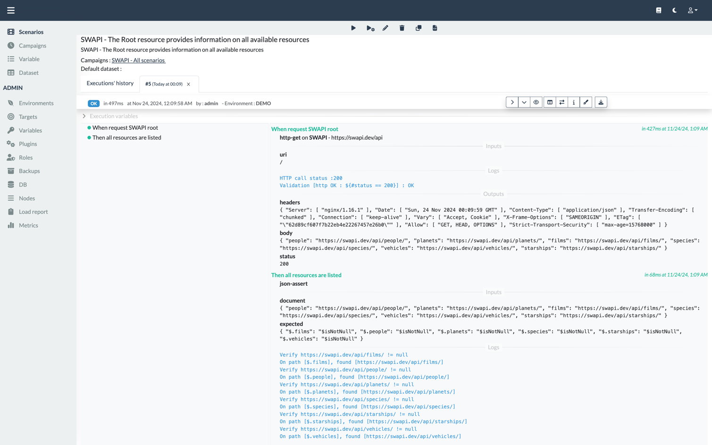
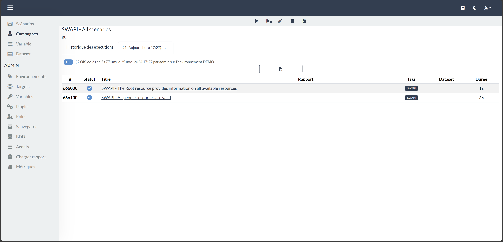

<!--
  ~ SPDX-FileCopyrightText: 2017-2024 Enedis
  ~
  ~ SPDX-License-Identifier: Apache-2.0
  ~
-->

{:target="_blank"}
{:target="_blank"}
{:target="_blank"}

----
**Spice up your spec , Better `taste` your app !**

Chutney helps you test deployed applications and validate functional requirements.  
Chutney provides you a set of capabilities for executing your scenario without having to write and maintain glue code.  

:material-rocket-launch: Install, configure, write and run your first scenario [here](/getting_started/requirements.md) !  
:octicons-book-16: You can find out a comprehensive list of what Chutney can do in the [documentation](/documentation/actions/introduction.md).

----
# Why another test tool ?

Chutney is an opinionated test tool based upon the practice of Specification by Example.

Chutney was inspired by Seb Rose blog post in which he revised the test pyramid according to test readability
[The Testing Iceberg](http://claysnow.co.uk/the-testing-iceberg/)

Chutney is not exactly what Seb Rose meant by using this metaphor.

But we envisioned a tool allowing multiple levels of readability, providing a single place for business people,
testers and developers to co-create, share and execute acceptance tests.

Moreover, we needed to :

* Promote and support Specification by Example across multiple teams and offices
* Ease collaboration and shared understanding in a "not so agile" environment
* Provide a single source of truth without hiding details in tests _glue code_
* Ease the automation of thousands of manual tests without writing and maintaining specific code
* Automate end-to-end tests of distributed software across secured networks, including hardware over telco networks

# What it is not

__Chutney is not a replacement for tools like Cucumber, etc.__

While having some overlap, they all fill different test aspect.

The key difference is the absence of glue and support code.

While we think that having glue code is cumbersome and adds unnecessary levels of indirection between the features and the system under test,
especially for high level tests and distributed software.

We also do think that using Cucumber for low level testing is sometimes very handy and useful,
thanks to the high level of expression provided by Gherkin (and this is part of the Testing Iceberg Seb Rose talked about).

__Chutney is no silver-bullet, it is just a tool which promotes and supports one way of doing software testing.__

As such, to benefit from it, we highly advise you to be proficient or to document yourself about
Behaviour-Driven-Development (by Dan North), Specification by Example (by Gojko Adzic) and Living Documentation (by Cyrille Martraire).
All of which, however you call it, define the same practices and share the same goals.

Global understanding of Test Driven Development and knowledge about Ubiquitous Language (from Domain Driven Design, by Eric Evans)
is also valuable.

# Front end

Chutney comes with a web application front end to launch and show executions of scenarios and campaigns.

*scenario execution report example*  

*campaign execution report example*  

